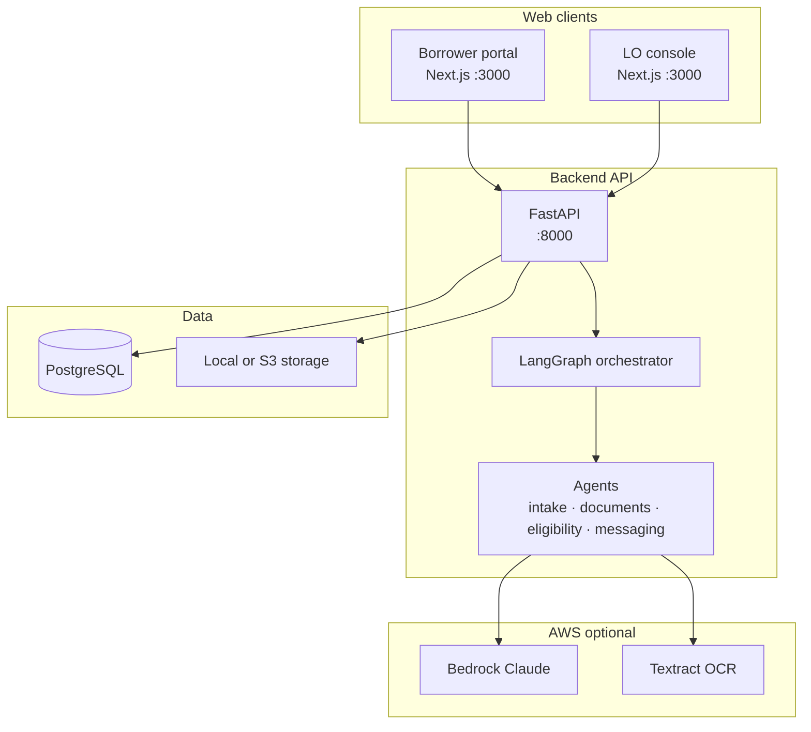

# Loan Officer Copilot (MVP)

A **mortgage loan officer and borrower copilot** that combines conversational intake, document understanding, and agentic reasoning—with **human-in-the-loop** approval before anything sensitive reaches the borrower.

Phase-1 scope: synthetic borrowers and documents, a small document set (pay stub, W-2, bank statement), and draft pre-qualification, not production credit decisions or LOS integration.

---

## What it does

| Persona | Experience |
|--------|------------|
| **Borrower** | Guided chat fills a simplified loan application; upload documents (W-2, pay stub, bank statement) in-portal with live OCR processing feedback; see LO-approved updates in chat. |
| **Loan officer / processor** | Review deals, correct extractions, run eligibility (DTI/LTV), edit conditions, approve internal and borrower-facing messages. |

**Core capabilities**

- **Conversational intake** — LangGraph + Amazon Bedrock structured turns; Pydantic validation before any application data is saved.
- **Document pipeline & OCR** — Live SSE stream updates borrowers as files undergo a 4-step processing pipeline:
  * **Parse**: Converts PDF/image uploads to text. Uses **LlamaCloud Parse** (default) or **AWS Textract** (`FeatureTypes=["FORMS", "TABLES"]` or `analyze_expense` for statements).
  * **Classify**: Identifies document type (`pay_stub`, `w2`, or `bank_statement`) using filename and content pattern heuristics with a fallback to Amazon Bedrock LLM classification.
  * **Extract**: Extracts critical numbers (such as gross income and assets) via structured **LlamaExtract** tasks or custom regex/key-value heuristics.
  * **Map**: Standardizes the extracted variables into a clean, uniform JSON schema saved to the database deal context.
- **Eligibility & conditions** — Deterministic rules engine with optional LLM refinement of condition wording.
- **Messaging** — Draft internal and borrower messages; **staff must approve** before borrowers see them.
- **Two portals** — Borrower portal and LO console (Next.js), backed by a FastAPI API.

---

## Architecture



### Request flows (simplified)

**Borrower intake turn**

1. Borrower posts a chat message → persisted as `ChatTurn`.
2. Intake agent loads recent history + application snapshot.
3. Bedrock returns structured `IntakeTurn` (patch, intent, reply).
4. Patch merged with optional L0 regex pre-fill → **Pydantic validate** → commit to `loan_applications`.
5. Assistant reply persisted; API returns progress (`captured_fields`, `missing_fields`, counts).

**Document upload**

1. Borrower uploads file → stored (local disk or S3).
2. UI opens **SSE** stream (`GET /documents/{id}/events`) for live status (parsing → extracting → done).
3. Background worker (LlamaCloud by default):
   - **Supported types only:** pay stub, W-2, bank statement
   - LlamaCloud **Parse** → classify → **Extract** (parse job ID) → map to `deal_context`
4. Staff review parsed text in `raw_ocr.text` plus structured `normalized` fields.

**Eligibility (staff-triggered)**

1. Rules engine computes DTI/LTV and suggested conditions from application + extracted data.
2. Optional Bedrock pass refines condition titles/rationales only.
3. Staff overrides and approves; borrower-visible messaging stays gated.

### Agent responsibilities

| Agent | Role |
|-------|------|
| **Intake** | Chat-driven application filling; invalid answers get LLM guidance (not blind repeats). |
| **Document understanding** | OCR + type classification + normalized extraction. |
| **Eligibility** | DTI/LTV thresholds and conditions list (authoritative numbers stay rule-based). |
| **Messaging** | Draft LO/borrower copy; approval required to publish. |

Deeper design: [`docs/design.md`](docs/design.md) · Full HTML architecture: [`docs/architecture.html`](docs/architecture.html) (open in a browser).

---

## Repository layout

```
LoanOfficer-Copilot/
├── backend/                 # FastAPI, agents, Alembic, tests
│   ├── app/
│   │   ├── api/             # REST routes (auth, deals, chat, documents, …)
│   │   ├── agents/          # LangGraph nodes, prompts, tools
│   │   ├── models/          # SQLAlchemy ORM
│   │   ├── schemas/         # Pydantic API + LLM I/O contracts
│   │   └── services/        # Bedrock, OCR, storage, business logic
│   ├── alembic/             # DB migrations
│   ├── scripts/             # seed, load_sample_docs, diagnose_textract, diagnose_llamaindex
│   └── tests/
├── frontend/                # Next.js 14 App Router + Tailwind
│   └── src/app/
│       ├── borrower/        # login, chat
│       └── console/         # staff deals, documents, eligibility, messages
├── infra/                   # docker-compose (Postgres, LocalStack)
├── samples/                 # Synthetic pay stub & W-2 for demos
└── docs/                    # requirements, design, implementation plan, …
```

---

## Tech stack

| Layer | Choices |
|-------|---------|
| API | Python 3.11+, FastAPI, SQLAlchemy, Alembic, PostgreSQL |
| Agents | LangGraph, LangChain AWS (Bedrock), optional LangSmith |
| Frontend | Next.js 14, React 18, Tailwind CSS |
| Document parsing | LlamaCloud Parse + Extract (default); AWS Textract only when `DOCUMENT_PARSER=textract` |
| Storage | Local filesystem or S3 (via LocalStack in compose) |
| Tooling | `uv` (backend), npm (frontend), pytest, Vitest |

---

## Prerequisites

- **Docker** — Postgres (and optional LocalStack for S3)
- **Python 3.11+** and **[uv](https://github.com/astral-sh/uv)**
- **Node.js 18+** and npm
- **AWS credentials** configured for **Amazon Bedrock** (chat and agents)
- **LlamaCloud API key** required for document uploads when `DOCUMENT_PARSER=llamaindex` ([free tier ~10k credits/month](https://www.llamaindex.ai/pricing))
- **Amazon Textract** only if you explicitly set `DOCUMENT_PARSER=textract` (requires activated Textract on your AWS account)

---

## Quick start

### 1. Start infrastructure

```bash
docker compose -f infra/docker-compose.yml up -d postgres
# Optional S3 via LocalStack:
# docker compose -f infra/docker-compose.yml up -d localstack
```

### 2. Backend

```bash
cd backend
# Create backend/.env from the Configuration table below (do not commit secrets)
uv sync --extra dev
uv run alembic upgrade head
uv run python -m scripts.seed_synthetic
uv run uvicorn app.main:app --reload --host 0.0.0.0 --port 8000
```

### 3. Frontend

```bash
cd frontend
npm install
npm run dev
```

Open **http://localhost:3000**

### Demo credentials

| Portal | URL | Credentials |
|--------|-----|-------------|
| Home | `/` | Links to both portals |
| Borrower | `/borrower/login` | Deal ID **1**, email **alice@example.com** (after seed) |
| Staff | `/console/login` | **lo@example.com** / **password** |

### Sample documents

Synthetic files for upload testing (no real PII):

- [`samples/synthetic_pay_stub.txt`](samples/synthetic_pay_stub.txt)
- [`samples/synthetic_w2.txt`](samples/synthetic_w2.txt)

**PDF versions** (for LlamaParse / real upload testing) — generate locally:

```bash
cd tools/synthetic-pdf-generator
uv sync && uv run python generate.py
# → output/synthetic_pay_stub.pdf, output/synthetic_w2.pdf
```

See [`tools/synthetic-pdf-generator/README.md`](tools/synthetic-pdf-generator/README.md) for upload and diagnose steps.

Load text fixtures into deal 1 via API:

```bash
cd backend
DEAL_ID=1 uv run python -m scripts.load_sample_docs
```

---

## Configuration

Create `backend/.env` (never commit secrets). Typical variables:

| Variable | Purpose |
|----------|---------|
| `DATABASE_URL` | PostgreSQL connection string |
| `JWT_SECRET` | Signing key for staff/borrower tokens |
| `AWS_REGION` | Bedrock + Textract region |
| `BEDROCK_MODEL_ID` | e.g. `anthropic.claude-3-haiku-20240307-v1:0` |
| `TEXTRACT_REGION` | Usually same as `AWS_REGION` |
| `DOCUMENT_PARSER` | `llamaindex` (default) or `textract` (explicit AWS opt-in) |
| `LLAMA_CLOUD_API_KEY` | LlamaCloud API key (alias: `LlamaIndex_API_KEY`) |
| `LLAMA_PARSE_TIER` | Parse tier: `cost_effective` (default), `fast`, `agentic`, `agentic_plus` |
| `LLAMA_EXTRACT_TIER` | Extract tier: `cost_effective` (default) or `agentic` |
| `LLAMA_JOB_TIMEOUT_SEC` | Max wait for Parse/Extract jobs (default `120`) |
| `STORAGE_BACKEND` | `local` or `s3` |
| `LOCAL_STORAGE_DIR` | Path for uploaded files when `local` |
| `OBSERVABILITY_PROVIDER` | `none` (default), `langsmith`, or `aws` (OpenTelemetry/ADOT) |
| `LANGSMITH_API_KEY` | Required when `OBSERVABILITY_PROVIDER=langsmith` |
| `LANGSMITH_PROJECT` | LangSmith project name (traces + eval datasets) |
| `OTEL_SERVICE_NAME` | Service name for AWS OTEL traces (default `loan-officer-copilot`) |
| `OTEL_EXPORTER_OTLP_ENDPOINT` | ADOT collector OTLP endpoint when `OBSERVABILITY_PROVIDER=aws` |

**Observability**

- **`OBSERVABILITY_PROVIDER=none`:** JSON structlog only (default local dev).
- **`OBSERVABILITY_PROVIDER=langsmith`:** LangChain traces + optional eval dataset sync (`scripts/sync_eval_datasets.py`).
- **`OBSERVABILITY_PROVIDER=aws`:** OpenTelemetry via ADOT → X-Ray / CloudWatch. Install extras: `uv sync --extra observability-aws`.
- **`GET /readyz`:** Readiness probe (database, storage, parser config).

**Evals**

```bash
cd backend
uv run pytest tests/eval/test_eval_schema.py tests/eval/test_eval_deterministic.py   # CI deterministic
uv run pytest tests/eval -m eval_smoke          # smoke LLM evals (needs AWS creds)
uv run python -m evals.runners.run_all --suite full --output eval-results.json  # nightly
```

**Document parsing notes**

- **Default (`DOCUMENT_PARSER=llamaindex`):** All uploads use LlamaParse → LlamaExtract. Only **pay stub, W-2, and bank statement** are accepted; other types fail with a clear error.
- **`DOCUMENT_PARSER=textract`:** Uses AWS Textract + regex mapper (dev `.txt` fixtures fall back to local text parsing if Textract is unavailable).
- **Borrower UI:** Subscribes to `GET /documents/{id}/events` (SSE via fetch + Bearer token) — no client polling loop.
- Diagnose LlamaCloud: `uv run python -m scripts.diagnose_llamaindex`
- Diagnose Textract: `uv run python -m scripts.diagnose_textract`

---

## API overview

| Area | Prefix | Auth |
|------|--------|------|
| Health | `GET /healthz`, `GET /readyz` | None |
| Staff auth | `POST /auth/staff/login` | — |
| Borrower session | `POST /auth/borrower/session` | — |
| Deals | `/deals` | Staff JWT |
| Borrower chat | `/borrower/chat` | Borrower JWT |
| Documents | `/documents`, `/documents/{id}/events` (SSE) | Borrower upload; staff read |
| Extractions | `/documents/{id}/extraction` | Staff |
| Eligibility | `/deals/{id}/eligibility` | Staff |
| Messages | `/deals/{id}/messages` | Staff |

Interactive API docs when the server is running: **http://localhost:8000/docs**

---

## Testing

```bash
# Backend (ephemeral Postgres per test session)
cd backend
uv run pytest -q

# Frontend
cd frontend
npm run typecheck
npm run test
npm run build
```

---

## Documentation

| Document | Description |
|----------|-------------|
| [`docs/requirements.md`](docs/requirements.md) | Product requirements and scope |
| [`docs/design.md`](docs/design.md) | Technical design and agent contracts |
| [`docs/implementation-plan.md`](docs/implementation-plan.md) | Phased build plan |
| [`docs/phases-completion-summary.md`](docs/phases-completion-summary.md) | What was delivered per phase |
| [`docs/architecture.html`](docs/architecture.html) | Self-contained architecture + SVG diagrams |

---

## Human-in-the-loop (non-negotiable)

- Eligibility **status**, DTI, and LTV come from the **rules engine**, not unconstrained LLM output.
- Borrower-facing text is stored as a **draft** until a staff user explicitly approves it.
- Extraction corrections are applied by staff in the console before downstream use.

---

## MVP limitations

- Synthetic data and documents only; not for production lending decisions.
- No credit bureau, pricing engine, or LOS integration.
- Narrow document and borrower scenarios (W-2-style employment, small doc set).
- Bedrock and Textract are **AWS billable** services; use budgets/quotas on cloud accounts.

---

## License

No license file is included yet. Treat this repository as private/internal unless a `LICENSE` is added.
