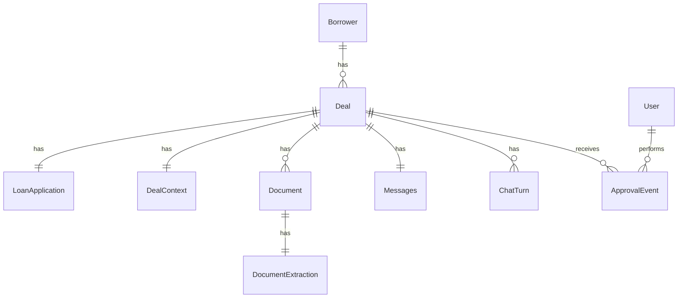
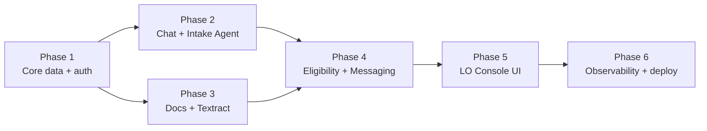

Document ID: PLAN-LOAN-COPILOT-MVP-001
Version: 1.0
Status: Draft
Project: Mortgage Loan Officer & Borrower Copilot – MVP
Last Updated: 2026-05-26
Owner: Engineering

References (single source of truth — do not duplicate content here):
- Requirements: [docs/requirements.md](docs/requirements.md)
- High-level design: [docs/design.md](docs/design.md)

# 1. Project summary and Phase-1 scope

This plan operationalizes the MVP described in [docs/requirements.md](docs/requirements.md) §4.1 and [docs/design.md](docs/design.md) §1–§2 into an executable, phase-by-phase build. The system is a web app with a React (Next.js App Router) frontend, a FastAPI backend, and a LangGraph + AWS Bedrock agent layer that calls AWS Textract for OCR/IDP. Data is persisted in a relational database (SQLite locally, PostgreSQL in deployed environments) via SQLAlchemy 2.0 + Alembic, and documents live in object storage (local filesystem in dev, S3 in deployed envs). All agent runs are traced in LangSmith.

Phase-1 ships the end-to-end loop for a single W-2 borrower: borrower chat intake → document upload → Textract-backed classification and extraction → eligibility & conditions draft → LO review/approval of extractions, status, and borrower-facing messages. Out-of-scope items (real credit pulls, pricing, multi-borrower, LOS integration, RAG over policy docs) follow the boundary in [docs/requirements.md](docs/requirements.md) §2.2 and §4.2.

# 2. Component breakdown

Each item below is a deliverable module owned by exactly one phase. The owning phase is listed in brackets.

## 2.1 Backend (FastAPI, Python 3.11)
- `backend/app/main.py` — ASGI app, router wiring, CORS, global middleware. [Phase 1]
- `backend/app/core/config.py` — `pydantic-settings` config (env vars, secrets, feature flags, Bedrock/Textract toggles). [Phase 1]
- `backend/app/core/logging.py` — `structlog` config with request-id and LangSmith trace-id correlation. [Phase 1, expanded Phase 6]
- `backend/app/core/security.py` — JWT helpers, password hashing (staff), borrower session token signing. [Phase 1]
- `backend/app/db/session.py`, `backend/app/db/base.py`, `backend/app/db/init_db.py` — SQLAlchemy engine/session, declarative base, dev seed entry point. [Phase 1]
- `backend/alembic/` + `backend/alembic.ini` — migrations (one per phase that changes the schema). [Phase 1]
- `backend/app/models/` — ORM models: `user.py`, `borrower.py`, `deal.py`, `loan_application.py`, `deal_context.py`, `document.py`, `document_extraction.py`, `message.py`, `chat.py`. [Phases 1–4]
- `backend/app/schemas/` — Pydantic v2 request/response schemas mirroring the models above plus `eligibility.py`. [Phases 1–4]
- `backend/app/api/`
  - `deps.py` — DB session, current user/borrower, deal-scope guard. [Phase 1]
  - `auth.py` — `POST /auth/staff/login`, `POST /auth/borrower/session` (magic-link-style synthetic session for MVP). [Phase 1]
  - `deals.py` — staff CRUD over deals + status transitions. [Phase 1]
  - `borrower_chat.py` — `POST /borrower/chat/messages`, `GET /borrower/chat/history`, `GET /borrower/application`. [Phase 2]
  - `documents.py` — `POST /documents` (upload), `GET /documents/{id}`, `GET /documents/{id}/file`, `POST /documents/{id}/extract`. [Phase 3]
  - `extractions.py` — `GET /documents/{id}/extraction`, `PUT /documents/{id}/extraction` (human corrections). [Phase 3]
  - `eligibility.py` — `POST /deals/{id}/eligibility/run`, `GET /deals/{id}/eligibility`, `POST /deals/{id}/eligibility/approve`. [Phase 4]
  - `messages.py` — `GET /deals/{id}/messages`, `PUT /deals/{id}/messages`, `POST /deals/{id}/messages/approve`. [Phase 4]
- `backend/app/services/`
  - `storage/base.py`, `storage/local.py`, `storage/s3.py` — pluggable object storage. [Phase 3]
  - `ocr/base.py`, `ocr/textract.py` — Textract `analyze_document` / `analyze_expense` wrapper returning a normalized `OcrResult`. [Phase 3]
  - `bedrock/client.py` — `langchain-aws` `ChatBedrockConverse` factory honoring config + LangSmith callbacks. [Phase 2]
  - `deals_service.py`, `documents_service.py`, `messages_service.py`, `approval_service.py` — business logic decoupled from API routers. [Phases 1, 3, 4, 5]
- `backend/app/agents/`
  - `state.py` — `LoanCopilotState` TypedDict (deal_id, loan_application snapshot, deal_context snapshot, latest event). [Phase 2]
  - `prompts/intake.py`, `prompts/document_understanding.py`, `prompts/eligibility.py`, `prompts/messaging.py` — system prompts pulled verbatim from [docs/design.md](docs/design.md) §4. [Phases 2–4]
  - `tools/application_writer.py` — structured tool that patches `LoanApplication`. [Phase 2]
  - `tools/ocr_runner.py` — agent-callable wrapper around `services/ocr/textract.py`. [Phase 3]
  - `tools/extraction_mapper.py` — pure functions mapping OCR JSON → `IncomeRecord` / `AssetRecord` / `ApplicantMetadata`. [Phase 3]
  - `tools/rules.py` — DTI/LTV thresholds and condition templates ([docs/requirements.md](docs/requirements.md) §5.4). [Phase 4]
  - `nodes/intake_agent.py`, `nodes/document_understanding_agent.py`, `nodes/eligibility_agent.py`, `nodes/messaging_agent.py` — LangGraph nodes. [Phases 2–4]
  - `orchestrator.py` — `build_graph()` assembling the LangGraph state machine described in [docs/design.md](docs/design.md) §2.4. [Phase 2, extended Phases 3–4]
  - `tracing.py` — LangSmith project/tag setup, callback registration. [Phase 2, expanded Phase 6]
- `backend/app/workers/document_pipeline.py` — invoked via FastAPI `BackgroundTasks` to run the document-understanding subgraph asynchronously. [Phase 3]
- `backend/tests/` — `pytest` unit + integration tests with `httpx.AsyncClient` and SQLite-in-memory. [Every phase]
- `backend/scripts/seed_synthetic.py`, `backend/scripts/load_sample_docs.py` — synthetic borrowers and fixture pay stubs / W-2s / bank statements. [Phase 1 (seed), Phase 3 (docs)]

## 2.2 Frontend (Next.js 14 App Router, React 18, TypeScript)
- `frontend/src/app/layout.tsx`, `frontend/src/app/page.tsx` — root layout + landing redirect. [Phase 1]
- `frontend/src/lib/api/client.ts` — typed `fetch` wrapper with auth header injection. [Phase 1]
- `frontend/src/lib/api/{borrowerChat,documents,deals,eligibility,messages}.ts` — one module per backend router. [Phases 2–4]
- `frontend/src/lib/auth.ts`, `frontend/src/lib/types.ts` — auth helpers and shared DTO types (kept in sync with backend Pydantic schemas via codegen task, see Phase 6). [Phase 1]
- Borrower portal [Phase 2 + Phase 3]:
  - `frontend/src/app/borrower/layout.tsx`
  - `frontend/src/app/borrower/login/page.tsx`
  - `frontend/src/app/borrower/chat/page.tsx` (entry route)
  - `frontend/src/app/borrower/ChatPage.tsx` (the client component referenced in the prompt)
  - `frontend/src/components/borrower/ChatWindow.tsx`, `ChatMessage.tsx`, `ChatInput.tsx`
  - `frontend/src/components/borrower/DocumentUploadCard.tsx`, `StatusPanel.tsx`
- LO/Processor console [Phase 5]:
  - `frontend/src/app/console/layout.tsx`
  - `frontend/src/app/console/deals/page.tsx`
  - `frontend/src/app/console/deals/[dealId]/page.tsx`
  - `frontend/src/app/console/deals/[dealId]/documents/page.tsx`
  - `frontend/src/app/console/deals/[dealId]/eligibility/page.tsx`
  - `frontend/src/app/console/deals/[dealId]/messages/page.tsx`
  - `frontend/src/components/console/DealList.tsx`, `DealHeader.tsx`, `ApplicationSummary.tsx`, `DocumentList.tsx`, `ExtractionReview.tsx`, `DocumentViewer.tsx`, `EligibilityPanel.tsx`, `ConditionsEditor.tsx`, `MessageApprovalPanel.tsx`

## 2.3 Cross-cutting infra
- `infra/docker-compose.yml` — `postgres`, `localstack` (S3 + optional Textract emulation), backend, frontend. [Phase 1, extended Phase 6]
- `infra/.env.example` — every required env var with placeholder values. [Phase 1]
- `.github/workflows/backend-ci.yml`, `.github/workflows/frontend-ci.yml` — lint + tests on PR. [Phase 6]

## 2.4 Data model (logical, expands [docs/design.md](docs/design.md) §2.5)

# 3. Phase plan

Each phase is independently buildable, testable, and demoable. Tasks are written as imperatives so a coding agent can pick them up one at a time.

---

## Phase 1 — Workspace, core data models, auth, deal CRUD

### Goals
- Stand up the monorepo, dev tooling, and CI scaffolding.
- Implement the persistent core (users, borrowers, deals, loan applications, deal context skeleton, messages skeleton).
- Ship staff JWT auth and synthetic borrower session token.
- Expose deal CRUD for the LO console to consume in Phase 5.

### Non-goals
- No agent logic, no document upload, no chat UI beyond a placeholder page.
- No real cloud deployment (Docker Compose only).

### Tasks
1. **Repo bootstrap.**
   - Create `backend/` (Python 3.11, `uv` or `pip-tools`, `pyproject.toml` with FastAPI, SQLAlchemy 2.0, Alembic, Pydantic v2, `pydantic-settings`, `structlog`, `pytest`, `httpx`, `langchain-aws`, `langgraph`, `langsmith`, `boto3`).
   - Create `frontend/` via `pnpm create next-app --typescript --app --eslint --tailwind` into `frontend/`.
   - Add `infra/docker-compose.yml` with `postgres:16` and `localstack` services and `infra/.env.example`.
2. **Backend skeleton.**
   - Implement `backend/app/main.py` with FastAPI app, CORS for `http://localhost:3000`, `/healthz` endpoint, and exception handler that returns JSON errors.
   - Implement `backend/app/core/config.py` (`Settings` class loading `DATABASE_URL`, `JWT_SECRET`, `AWS_REGION`, `BEDROCK_MODEL_ID`, `TEXTRACT_REGION`, `LANGSMITH_API_KEY`, `LANGSMITH_PROJECT`, `STORAGE_BACKEND`, `S3_BUCKET`, `LOCAL_STORAGE_DIR`).
   - Implement `backend/app/core/logging.py` with `structlog` JSON renderer and request-id middleware.
   - Implement `backend/app/db/session.py`, `backend/app/db/base.py`, and `backend/app/db/init_db.py`.
3. **Models & migrations.**
   - Create ORM models: `User`, `Borrower`, `Deal` (status enum: `intake_in_progress`, `docs_pending`, `extraction_in_progress`, `ready_for_review`, `lo_approved`, `closed`), `LoanApplication` (JSON column for structured fields keyed off the schema in [docs/requirements.md](docs/requirements.md) §5.1), `DealContext` (JSON columns for income, assets, liabilities, computed metrics, status flags), `Messages` (internal_notes, borrower_message, approval flags). Add `created_at`/`updated_at` mixins.
   - Initialize Alembic; generate baseline migration `0001_init.py` creating all tables above. `Document`, `DocumentExtraction`, and `ChatTurn` are stubbed in later phases.
4. **Pydantic schemas.**
   - Mirror each model in `backend/app/schemas/` with `Read`, `Create`, `Update` variants. Define `LoanApplicationData` as a strict nested Pydantic model (Identity, Contact, Employment, Income, Assets, Liabilities, Property, LoanPurpose) so it serves as the canonical contract for the Intake Agent in Phase 2.
5. **Auth.**
   - `backend/app/core/security.py`: `create_access_token`, `verify_password`, `sign_borrower_session(deal_id)`, `verify_borrower_session`.
   - `backend/app/api/auth.py`:
     - `POST /auth/staff/login` → email+password → JWT.
     - `POST /auth/borrower/session` → `{deal_id, borrower_email}` → signed token scoped to that deal (MVP placeholder for real magic link).
   - `backend/app/api/deps.py`: `get_db`, `get_current_user` (staff JWT), `get_borrower_session` (scoped token), `require_deal_access`.
6. **Deal CRUD.**
   - `backend/app/services/deals_service.py`: `create_deal`, `get_deal`, `list_deals(filter_by_status)`, `transition_status`.
   - `backend/app/api/deals.py`: `POST /deals`, `GET /deals`, `GET /deals/{id}`, `PATCH /deals/{id}` (staff-only). Returns nested `LoanApplication` and `DealContext` placeholders.
7. **Seed.**
   - `backend/scripts/seed_synthetic.py`: create 1 staff user (`lo@example.com`), 3 synthetic borrowers, 1 empty deal per borrower.
8. **Frontend scaffold.**
   - Implement `frontend/src/lib/api/client.ts`, `frontend/src/lib/auth.ts`.
   - Create `frontend/src/app/page.tsx` landing page with two links: `Borrower demo` (`/borrower/login`) and `LO Console` (`/console/deals`). The two destination pages are placeholders that say "coming in Phase 2 / Phase 5"; this is enough to exercise routing and the auth flow shell.
   - Implement `frontend/src/app/borrower/login/page.tsx` calling `POST /auth/borrower/session`.

### Migrations
- `0001_init.py` — creates `users`, `borrowers`, `deals`, `loan_applications`, `deal_contexts`, `messages`.

### Test strategy
- Unit: `tests/unit/test_security.py` (token round-trip), `tests/unit/test_config.py`.
- Integration: `tests/integration/test_auth_api.py` (staff login happy/sad), `tests/integration/test_deals_api.py` (CRUD + access control: borrower token cannot list deals; staff token can).
- Manual: `docker compose up`, run `python -m backend.scripts.seed_synthetic`, hit `/healthz`, log in as staff via `curl`, list deals.

---

## Phase 2 — Borrower chat & Intake Agent

### Goals
- Borrower can have a structured conversation that fills `LoanApplicationData`.
- Intake Agent runs on LangGraph + Bedrock, writes updates through the `application_writer` tool, and asks one clarifying question at a time per [docs/design.md](docs/design.md) §4.
- LangSmith traces every chat turn with `deal_id` metadata.

### Non-goals
- No document upload (Phase 3).
- No eligibility computation or messaging agent (Phase 4).

### Tasks
1. **Chat persistence.**
   - Add ORM `ChatTurn(deal_id, role: enum[borrower, assistant, system], content, structured_payload JSON, created_at)` in `backend/app/models/chat.py`.
   - Alembic migration `0002_chat_turns.py`.
2. **Bedrock + tracing wiring.**
   - `backend/app/services/bedrock/client.py`: `get_chat_model(temperature, tags)` returning a `ChatBedrockConverse` instance with LangSmith callbacks.
   - `backend/app/agents/tracing.py`: `configure_langsmith()` called from `main.py` startup; helper `with_deal_metadata(deal_id)`.
3. **Agent state & tool.**
   - `backend/app/agents/state.py`: `LoanCopilotState = TypedDict(... loan_application: LoanApplicationData, latest_borrower_message: str, assistant_reply: str, missing_fields: list[str])`.
   - `backend/app/agents/tools/application_writer.py`: LangChain `@tool` that accepts a partial `LoanApplicationData` patch, validates with Pydantic, and persists via `deals_service.update_loan_application(deal_id, patch)`. Returns the merged snapshot and a computed `missing_fields` list.
4. **Intake Agent node + graph.**
   - `backend/app/agents/prompts/intake.py`: system prompt verbatim from [docs/design.md](docs/design.md) §4 (Borrower Chat & Intake Agent) + JSON schema of `LoanApplicationData` injected as context.
   - `backend/app/agents/nodes/intake_agent.py`: `intake_node(state) -> state`, binds `application_writer` as a tool, loops one tool call per turn, returns `assistant_reply`.
   - `backend/app/agents/orchestrator.py`: `build_graph()` with a single `intake` node + a conditional edge that terminates when `missing_fields` is empty and sets `Deal.status = docs_pending`.
5. **Borrower chat API.**
   - `backend/app/api/borrower_chat.py`:
     - `POST /borrower/chat/messages` — body `{content}`. Persists borrower turn, invokes `build_graph().invoke(state)`, persists assistant turn, returns `{assistant_message, application_snapshot, missing_fields}`.
     - `GET /borrower/chat/history` — paginated turns scoped to the borrower's deal.
     - `GET /borrower/application` — current `LoanApplicationData`.
6. **Borrower chat UI.**
   - `frontend/src/app/borrower/chat/page.tsx` renders `frontend/src/app/borrower/ChatPage.tsx` (client component).
   - `ChatPage.tsx` orchestrates `ChatWindow` + `ChatInput` + `StatusPanel`; uses `frontend/src/lib/api/borrowerChat.ts` for send/history.
   - `StatusPanel.tsx` displays `missing_fields` so the borrower sees progress.
7. **Logging.**
   - Each agent invocation logs `event=intake_turn`, `deal_id`, `langsmith_run_id`, `latency_ms`.

### Migrations
- `0002_chat_turns.py`.

### Test strategy
- Unit: `tests/unit/agents/test_application_writer.py` (patch validation, missing-field computation), `tests/unit/agents/test_intake_prompt.py` (prompt assembly).
- Integration (with Bedrock mocked via `langchain_core.fake.FakeMessagesListChatModel`): `tests/integration/test_borrower_chat_api.py` — script a 3-turn conversation that completes the application and asserts `Deal.status == docs_pending`.
- Manual: log in as borrower, complete an intake; verify a single LangSmith trace per turn tagged `borrower_chat` and metadata `deal_id`.

---

## Phase 3 — Document upload, Textract pipeline, extraction review API

### Goals
- Borrower can upload PDFs/images mid-chat.
- Documents are classified, OCR'd via Textract, and mapped to normalized entities in `DealContext`.
- LO console has API endpoints to read extractions and submit corrections.

### Non-goals
- No eligibility scoring yet (Phase 4).
- No console UI yet (Phase 5); this phase ships APIs + agent only.

### Tasks
1. **Models & migration.**
   - `backend/app/models/document.py`: `Document(id, deal_id, storage_uri, original_filename, mime_type, predicted_type enum[pay_stub, w2, bank_statement, application_1003, unknown], classification_confidence, extraction_status enum[pending, running, succeeded, failed], uploaded_at)`.
   - `backend/app/models/document_extraction.py`: `DocumentExtraction(id, document_id, raw_ocr JSON, normalized JSON, confidence JSON, human_corrections JSON, status, updated_at)`.
   - Alembic `0003_documents.py`.
2. **Storage abstraction.**
   - `backend/app/services/storage/base.py` (`put`, `get`, `presigned_url`); `local.py` writes under `LOCAL_STORAGE_DIR`; `s3.py` uses boto3 against `S3_BUCKET`.
3. **Textract client.**
   - `backend/app/services/ocr/base.py`: `OcrResult` dataclass (`text`, `key_values`, `tables`, `raw`).
   - `backend/app/services/ocr/textract.py`: `analyze(document_bytes, doc_type_hint)` calls `analyze_document` (FORMS+TABLES) for pay stubs/W-2s and `analyze_expense` for bank statements. Returns normalized `OcrResult`.
4. **Document upload API.**
   - `backend/app/api/documents.py`:
     - `POST /documents` (multipart) — stores file, creates `Document` (status `pending`), enqueues background task `run_document_pipeline(document_id)`, returns the new `Document`.
     - `GET /documents?deal_id=` and `GET /documents/{id}`.
     - `GET /documents/{id}/file` — streamed bytes or presigned redirect for the viewer.
5. **Document Understanding Agent.**
   - `backend/app/agents/tools/ocr_runner.py` wraps `services/ocr/textract.py`.
   - `backend/app/agents/tools/extraction_mapper.py`: pure functions `map_pay_stub`, `map_w2`, `map_bank_statement`, `map_application_1003` → `IncomeRecord`, `AssetRecord`, `ApplicantMetadata` Pydantic models (declared in `backend/app/schemas/deal_context.py`).
   - `backend/app/agents/prompts/document_understanding.py` (system prompt per [docs/design.md](docs/design.md) §4).
   - `backend/app/agents/nodes/document_understanding_agent.py`: classifies (LLM with structured output over allowed types using the filename + first OCR page text as features), invokes `ocr_runner`, calls the right `extraction_mapper`, returns extraction + confidences.
   - Extend `orchestrator.py` with a `document_understanding` subgraph reachable from `workers/document_pipeline.py`.
6. **Background worker.**
   - `backend/app/workers/document_pipeline.py`: `run_document_pipeline(document_id)` — sets status `running`, runs the subgraph, persists `DocumentExtraction`, merges normalized entities into `DealContext` (additive, never overwrites human corrections), sets `succeeded`/`failed`. Triggered via FastAPI `BackgroundTasks` from `POST /documents`.
7. **Extraction review API.**
   - `backend/app/api/extractions.py`: `GET /documents/{id}/extraction`, `PUT /documents/{id}/extraction` accepting a JSON patch; stores it in `human_corrections` and re-merges `DealContext` per [docs/requirements.md](docs/requirements.md) §5.3.
8. **Borrower upload UI hook.**
   - In `frontend/src/components/borrower/DocumentUploadCard.tsx`, wire `POST /documents` and poll `GET /documents/{id}` until `extraction_status != pending|running`; surface a short summary in chat.
9. **Synthetic fixtures.**
   - `backend/scripts/load_sample_docs.py` and `backend/tests/fixtures/documents/` with 2 pay stubs, 1 W-2, 1 bank statement (synthetic, public-safe).

### Migrations
- `0003_documents.py` — `documents`, `document_extractions`.

### Test strategy
- Unit: `tests/unit/agents/test_extraction_mapper.py` (golden OCR JSON → expected normalized output for each doc type), `tests/unit/services/test_storage_local.py`.
- Integration (Textract mocked with `botocore.stub.Stubber` returning canned responses): `tests/integration/test_document_pipeline.py` — POST upload, await background task, assert `DocumentExtraction.normalized` and updated `DealContext`. Plus `tests/integration/test_extraction_corrections.py` for the PUT flow.
- Manual: upload each fixture via the borrower UI, confirm `Document.extraction_status == succeeded`, inspect DB row, and see the LangSmith trace tagged `doc_understanding`.

---

## Phase 4 — Eligibility, conditions, explanation & messaging agents

### Goals
- Compute DTI/LTV and assign status per [docs/requirements.md](docs/requirements.md) §5.4.
- Generate a structured conditions list and both internal + borrower-facing draft messages per [docs/requirements.md](docs/requirements.md) §5.5.
- Expose APIs the Phase-5 LO console will drive.

### Non-goals
- No final UI polish for messages (basic editor textbox is acceptable).
- No automatic re-runs when corrections change (manual re-run endpoint only; auto-trigger is a Phase 6 hook).

### Tasks
1. **Schemas & models.**
   - `backend/app/schemas/eligibility.py`: `EligibilityResult(status: enum[green, yellow, red], dti, ltv, rule_evaluations: list[RuleEvaluation], computed_at)`, `Condition(id, code, title, rationale, required_doc_type | None)`, `ConditionsList`.
   - Extend `DealContext` with `eligibility JSON` and `conditions JSON` columns; Alembic `0004_eligibility.py`.
   - Extend `Messages` with `internal_draft`, `internal_approved`, `borrower_draft`, `borrower_approved`, `approved_by_user_id`, `approved_at`.
2. **Rules engine.**
   - `backend/app/agents/tools/rules.py`: pure Python — configurable thresholds (default DTI 43/50, LTV 80/95), required-fields checks, condition templates (e.g., `single_pay_stub`, `large_deposit_unclear`, `missing_property_value`).
3. **Eligibility & Conditions Agent.**
   - `backend/app/agents/prompts/eligibility.py` (verbatim from [docs/design.md](docs/design.md) §4).
   - `backend/app/agents/nodes/eligibility_agent.py`: deterministic compute via `rules.py`, then Bedrock call asked to *only* explain and refine the conditions list within the structured schema. LLM cannot change `status`, `dti`, or `ltv`.
4. **Explanation & Messaging Agent.**
   - `backend/app/agents/prompts/messaging.py` (verbatim from [docs/design.md](docs/design.md) §4).
   - `backend/app/agents/nodes/messaging_agent.py`: produces `internal_draft` and `borrower_draft`, grounded only on `EligibilityResult` + `ConditionsList` + identity fields.
5. **Orchestration.**
   - Extend `orchestrator.py` with an `eligibility_then_messaging` subgraph invoked by `POST /deals/{id}/eligibility/run`.
6. **APIs.**
   - `backend/app/api/eligibility.py`:
     - `POST /deals/{id}/eligibility/run` — runs the subgraph, persists results, transitions `Deal.status` to `ready_for_review`.
     - `GET /deals/{id}/eligibility`.
     - `PATCH /deals/{id}/eligibility` — LO override of `status`/`conditions`.
     - `POST /deals/{id}/eligibility/approve`.
   - `backend/app/api/messages.py`:
     - `GET /deals/{id}/messages`, `PUT /deals/{id}/messages` (edit drafts), `POST /deals/{id}/messages/approve` (per-channel approval flags).
   - `backend/app/services/approval_service.py`: enforces invariant from [docs/requirements.md](docs/requirements.md) §5.6 that borrower-facing message is only readable on the borrower side after `borrower_approved=True`.
7. **Borrower-visible status surfacing.**
   - Extend `GET /borrower/application` to include `approved_borrower_message` only when `borrower_approved=True`; never expose `internal_draft`.

### Migrations
- `0004_eligibility.py` — adds `deal_contexts.eligibility`, `deal_contexts.conditions`, `messages.*` draft/approval columns.

### Test strategy
- Unit: `tests/unit/agents/test_rules.py` (green/yellow/red threshold matrix, condition triggers), `tests/unit/agents/test_messaging_prompt.py`.
- Integration: `tests/integration/test_eligibility_flow.py` — seed deal with full intake + extracted docs, run endpoint, assert deterministic DTI/LTV, status, ≥1 condition, both message drafts present. `tests/integration/test_approval_gates.py` — borrower API hides `borrower_draft` until approved.
- Manual: from a Phase-3-complete deal, `POST /deals/{id}/eligibility/run`, inspect drafts, edit and approve via API.

---

## Phase 5 — LO/Processor Console UI

### Goals
- Build the staff-facing UI that consumes every API from Phases 1–4 and enforces the human-in-the-loop workflow in [docs/requirements.md](docs/requirements.md) §5.6.
- Provide the side-by-side document viewer + extraction editor.

### Non-goals
- No bulk operations, no analytics dashboards.
- No real-time push; polling is acceptable.

### Tasks
1. **Console shell & auth.**
   - `frontend/src/app/console/layout.tsx` with staff JWT guard; redirects to a `frontend/src/app/console/login/page.tsx` when unauthenticated.
2. **Deal list.**
   - `frontend/src/app/console/deals/page.tsx` + `frontend/src/components/console/DealList.tsx`: filters by `Deal.status`, shows borrower name and last activity, links to detail.
3. **Deal detail.**
   - `frontend/src/app/console/deals/[dealId]/page.tsx` composes `DealHeader`, `ApplicationSummary`, tabbed routes for `documents`, `eligibility`, `messages`.
   - `ApplicationSummary.tsx` renders the full `LoanApplicationData` and flags any gaps.
4. **Documents & extraction review.**
   - `frontend/src/app/console/deals/[dealId]/documents/page.tsx` renders `DocumentList` + selected-doc `ExtractionReview`.
   - `DocumentViewer.tsx` embeds the PDF/image via `GET /documents/{id}/file`.
   - `ExtractionReview.tsx` shows normalized fields with inline editors backed by `PUT /documents/{id}/extraction`; visually marks low-confidence fields.
5. **Eligibility & conditions panel.**
   - `frontend/src/app/console/deals/[dealId]/eligibility/page.tsx` + `EligibilityPanel.tsx` + `ConditionsEditor.tsx`: shows DTI/LTV, status with override dropdown, editable conditions list, `Run eligibility` and `Approve eligibility` buttons.
6. **Message approval.**
   - `frontend/src/app/console/deals/[dealId]/messages/page.tsx` + `MessageApprovalPanel.tsx`: two editors (internal, borrower-facing), per-channel approve toggle; disables approve until non-empty.
7. **Wiring.**
   - `frontend/src/lib/api/{deals,documents,extractions,eligibility,messages}.ts`.
   - Shared status-chip component for the `Deal.status` enum.
8. **Borrower-side echo.**
   - When `Messages.borrower_approved=True`, surface the approved message inline in `ChatWindow` as a system turn ([docs/requirements.md](docs/requirements.md) §5.5).

### Migrations
- None.

### Test strategy
- Unit: Vitest + React Testing Library for `ExtractionReview`, `ConditionsEditor`, `MessageApprovalPanel` (rendering, edit, approve disabled/enabled).
- Integration: Playwright spec `frontend/tests/e2e/lo_review.spec.ts` — log in as staff, open a seeded ready-for-review deal, correct one extraction field, approve eligibility and messages, then verify in the borrower window that the approved message now appears.
- Manual: walk the full borrower → LO → borrower loop with the synthetic fixtures from Phase 3.

---

## Phase 6 — Observability, hardening, deployability

### Goals
- Production-quality logs, traces, and metrics for an MVP environment.
- Stable CI, type sharing, error handling, and a smoke deploy path.

### Non-goals
- No Terraform yet (call out as future work per [docs/requirements.md](docs/requirements.md) §6 Deployability).
- No multi-tenant or SSO.

### Tasks
1. **Tracing & logging polish.**
   - In `backend/app/agents/tracing.py`, register `LangChainTracer` with per-agent project tags (`borrower_chat`, `doc_understanding`, `eligibility`, `messaging`) and inject `deal_id`, `document_id`, `user_id` as run metadata.
   - In `backend/app/core/logging.py`, correlate request-id ↔ LangSmith `run_id`; add `X-Request-Id` propagation middleware.
2. **Event log.**
   - Add `backend/app/models/event_log.py` and migration `0005_event_log.py`. Emit events `intake_complete`, `document_extracted`, `eligibility_computed`, `messages_approved` ([docs/requirements.md](docs/requirements.md) §6 Observability).
3. **Type safety across the stack.**
   - Add a script `backend/scripts/export_openapi.py` and `frontend/scripts/generate-types.ts` (using `openapi-typescript`) producing `frontend/src/lib/types.generated.ts`. Wire into CI.
4. **Hardening.**
   - Rate-limit `POST /borrower/chat/messages` and `POST /documents` (in-process token bucket is fine for MVP).
   - Centralize Bedrock + Textract retries with exponential backoff in their service wrappers.
   - Add `/readyz` that checks DB + storage + Bedrock model availability.
5. **CI.**
   - `.github/workflows/backend-ci.yml`: ruff, mypy, pytest, alembic upgrade head against SQLite.
   - `.github/workflows/frontend-ci.yml`: eslint, tsc, vitest, playwright (headless).
6. **Deploy path.**
   - Backend `Dockerfile` (gunicorn + uvicorn workers) and frontend `Dockerfile` (Next standalone build).
   - Extend `infra/docker-compose.yml` to run the full stack against PostgreSQL + LocalStack S3 with the same env-var contract as production.
   - `docs/runbook.md` — env vars, smoke checklist, how to revoke a borrower session.
7. **Demo polish.**
   - Loading and empty states across the console.
   - Clear "Draft — not yet approved by LO" banner on every borrower-facing surface ([docs/design.md](docs/design.md) §5).

### Migrations
- `0005_event_log.py`.

### Test strategy
- Unit: `tests/unit/test_event_log.py`, `tests/unit/services/test_textract_retry.py`.
- Integration: `tests/integration/test_observability.py` — every key event produces an `EventLog` row and a LangSmith run tag.
- Manual: run the full Phase-5 happy path, then verify (a) LangSmith shows 4 distinct projects/tags, (b) `EventLog` contains all four event types in order, (c) `/readyz` returns 200.

---

# 4. Risks, dependencies, and cross-cutting concerns

These items are shared across phases. The right column names the *earliest* phase that depends on each item being in place.

- **AWS credentials & Bedrock model access** (required for chat, classification fallback, messaging). Confirm model id (e.g., `anthropic.claude-3-5-sonnet-20240620-v1:0`) is enabled in `AWS_REGION`. Earliest dependency: Phase 2.
- **AWS Textract entitlement and region parity** with Bedrock. Earliest dependency: Phase 3. Mitigation: `services/ocr/base.py` interface lets us mock Textract for tests and swap providers if entitlement is delayed.
- **LangSmith project + API key** (`LANGSMITH_PROJECT`, `LANGSMITH_API_KEY`). Earliest dependency: Phase 2. Mitigation: `tracing.py` no-ops when the key is absent so local dev does not require it.
- **Secrets management.** All secrets read via `pydantic-settings` from `.env` locally and from environment in deployed envs; never committed. Earliest dependency: Phase 1.
- **Auth scoping invariant.** Borrower tokens are scoped to a single `deal_id`; staff JWTs grant access to all deals. The `require_deal_access` dependency enforces this for every endpoint that takes a `deal_id`. Earliest dependency: Phase 1, re-verified in Phase 5 by Playwright.
- **Database portability (SQLite ↔ PostgreSQL).** Use only SQLAlchemy-portable types; for JSON, use `sqlalchemy.JSON` (maps to JSONB on Postgres). CI runs migrations against both. Earliest dependency: Phase 1.
- **Object storage portability.** All code accesses storage through `services/storage/base.py`; never call boto3 from routes. Earliest dependency: Phase 3.
- **Synthetic-only data.** Per [docs/design.md](docs/design.md) §5, fixtures and seeds must contain placeholder PII tokens only. Reviewed in Phase 3 fixture PR.
- **Human-in-the-loop invariant.** The approval gate in [docs/requirements.md](docs/requirements.md) §5.6 / §6 is enforced server-side by `approval_service.py` (Phase 4) and verified by `tests/integration/test_approval_gates.py`. UI is a secondary defense.
- **Background work in Phase 3** uses FastAPI `BackgroundTasks` for MVP simplicity. If Phase 6 needs durable retries, swap in RQ or Celery behind the existing `workers/document_pipeline.py` entry point — no API surface change.
- **OCR accuracy variability** ([docs/requirements.md](docs/requirements.md) §7). Mitigation: the LO console's `ExtractionReview` (Phase 5) is the safety net; corrections always win over machine values.

# 5. Sequencing summary

Phases 2 and 3 can be developed in parallel by two agents once Phase 1 lands, since they touch disjoint files except for the shared `orchestrator.py` (merge with care). Phase 4 must wait for both. Phase 5 is purely additive on top of Phase 1–4 APIs.
